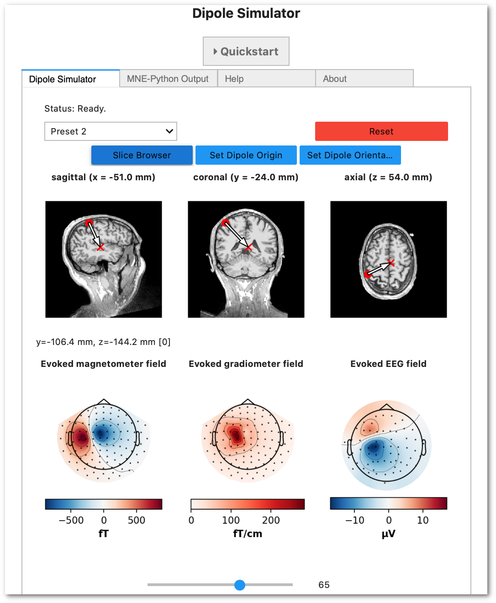

# M/EEG Dipole Simulator

An interactive demonstration of how dipole location and orientation affect MEG
and EEG sensor signals.

**This is still [work in progress](https://github.com/hoechenberger/dipoles_demo/issues/26).**

Start the application by clicking on the ``launch binder`` button above. Binder might take a while to start up, so please be patient.

### Screenshot

### Contributors
- Idea & Conceptualization: **Maximilien Chaumon**
  ([GitHub](https://github.com/dnacombo),
  [Twitter](https://twitter.com/@cuttingEEG))
- Conceptualization & Supervision: **Alexandre Gramfort**
  ([GitHub](https://github.com/agramfort),
  [Twitter](https://twitter.com/agramfort))
- Testing & Feedback: **Sophie Herbst**
  ([GitHub](https://github.com/SophieHerbst),
  [Twitter](https://twitter.com/herbstso)) &
  **Virginie van Wassenhove**
  ([GitHub](https://github.com/virvw),
  [Twitter](https://twitter.com/virginie_vw))
- Implementation: **Richard Höchenberger**
  ([GitHub](https://github.com/hoechenberger),
  [Twitter](https://twitter.com/RHoechenberger))

